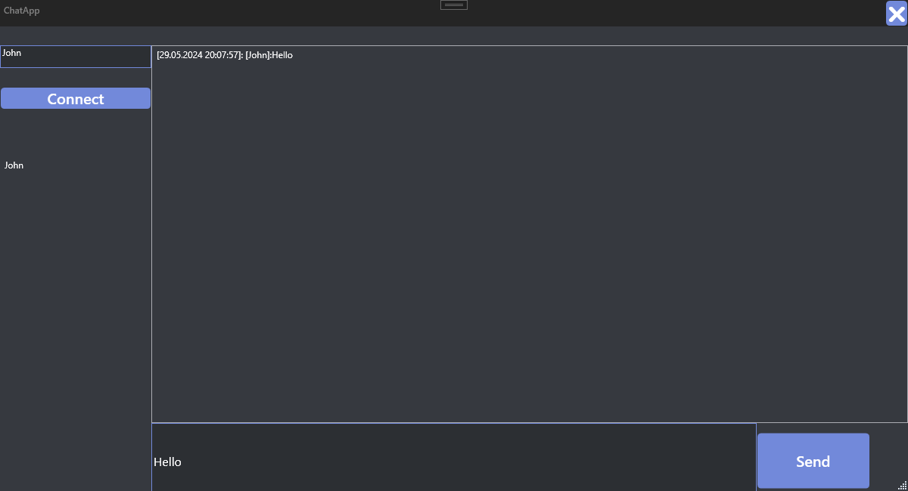
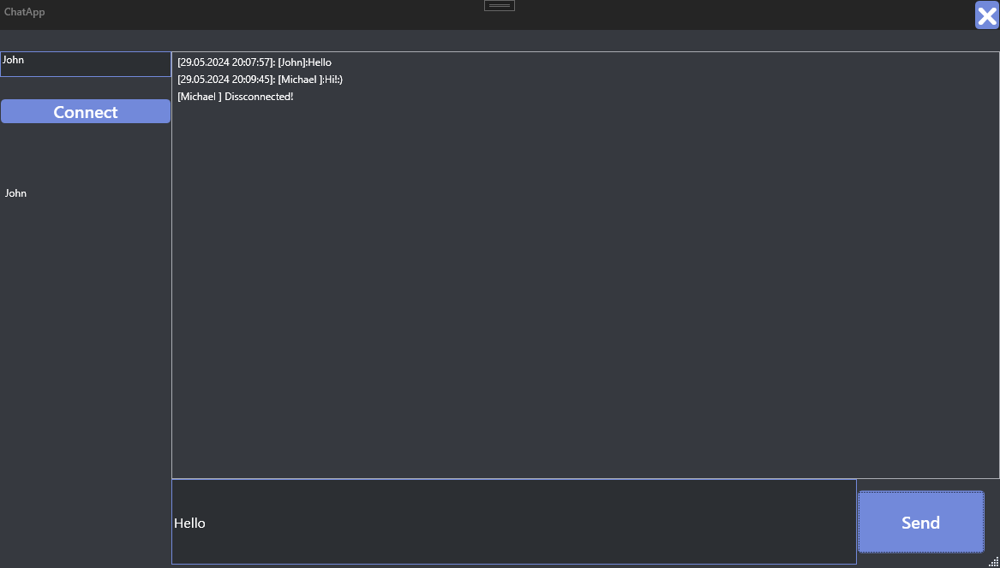

# Chat App

## Description
This project is a chat application developed in C# using the MVVM (Model-View-ViewModel) architectural pattern. It utilizes TCP listener and TCP client for communication between clients and the server. The application allows users to connect to a server, exchange messages in real-time, and disconnect gracefully. 

## 📌 Features
- **Real-time Communication**: Users can exchange messages with each other in real-time.
- **MVVM Architecture**: Utilizes the Model-View-ViewModel architectural pattern for a clear separation of concerns and easier maintenance.
- **TCP Listener and TCP Client**: Implements TCP listener on the server side and TCP client on the client side for communication.
- **Graceful Disconnection**: Provides a mechanism for users to disconnect from the server gracefully.

## 📊 Implementation Overview
- **Client Class**: Represents a client connected to the server, encapsulating its username, unique identifier, and communication functionality.
- **Server Class**: Manages connections from multiple clients, broadcasts messages, and handles disconnections.
- **PacketBuilder Class**: Builds packets for communication between the server and clients.
- **PacketReader Class**: Reads packets received by the server from clients.
- **RelayCommand Class**: Implements ICommand interface for use in MVVM pattern, allowing commands to be bound to UI controls.
- **UserModel Class**: Represents a user in the application, containing properties for username and unique identifier.
- **MainViewModel Class**: Acts as the view model for the main window of the application, handling user interactions, server communication, and updating the UI.

## Screenshots
### User Connection

### User Disconnection

##✍️ by Teulea Ioan Octavian

